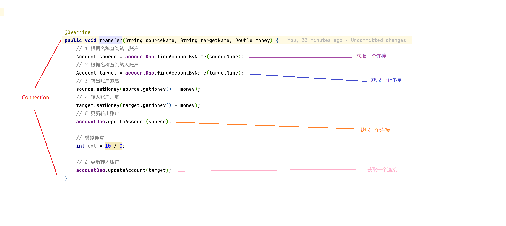
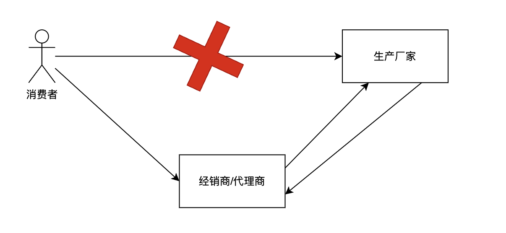
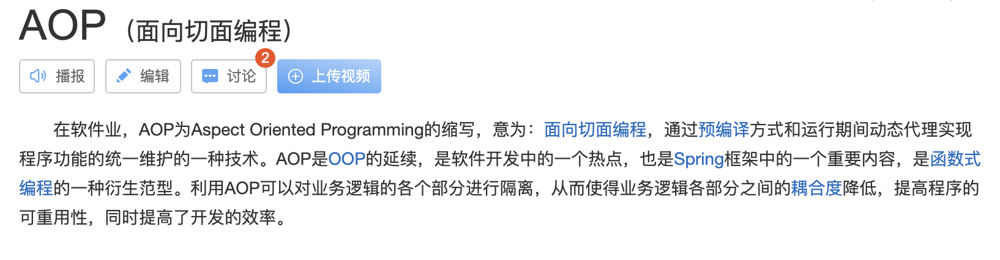

# Spring5 第三天

## 第一章 AOP 的相关概念

### 1.1 转账案例说明事物问题

#### 转账案例

账户实体

```sql
@Data
public class Account implements Serializable {

    private static final long serialVersionUID = -3564169976835948442L;

    private Long id;

    private String name;

    private Double money;
}
```

业务层接口

```java
// 账户的业务层接口
public interface IAccountService {

    /**
     * 查询所有账户数据
     *
     * @return 所有的账户数据
     */
    List<Account> findAllAccount();

    /**
     * 根据账户id获取账户信息
     *
     * @param id 账户id
     * @return 账户信息
     */
    Account findAccountById(Long id);

    /**
     * 保存账户信息
     *
     * @param account 账户信息
     */
    void saveAccount(Account account);

    /**
     * 更新账户信息
     *
     * @param account 账户信息
     */
    void updateAccount(Account account);

    /**
     * 根据账户id删除账户信息
     *
     * @param id 账户id
     */
    void deleteAccount(Long id);

    /**
     * 转账操作
     *
     * @param sourceName 转出账户名
     * @param targetName 转入账户名
     * @param money      转账金额
     */
    void transfer(String sourceName, String targetName, Double money);
}
```

业务层接口实现类

```java
// 账户的业务层接口实现类
public class AccountServiceImpl implements IAccountService {

    private IAccountDao accountDao;

    /**
     * 使用set方法注入IAccountDao
     * @param accountDao 账户持久层接口
     */
    public void setAccountDao(IAccountDao accountDao) {
        this.accountDao = accountDao;
    }

    @Override
    public List<Account> findAllAccount() {
        return accountDao.findAllAccount();
    }

    @Override
    public Account findAccountById(Long id) {
        return accountDao.findAccountById(id);
    }

    @Override
    public void saveAccount(Account account) {
        accountDao.saveAccount(account);
    }

    @Override
    public void updateAccount(Account account) {
        accountDao.updateAccount(account);
    }

    @Override
    public void deleteAccount(Long id) {
        accountDao.deleteAccount(id);
    }

    @Override
    public void transfer(String sourceName, String targetName, Double money) {
        // 1.根据名称查询转出账户
        Account source = accountDao.findAccountByName(sourceName);
        // 2.根据名称查询转入账户
        Account target = accountDao.findAccountByName(targetName);
        // 3.转出账户减钱
        source.setMoney(source.getMoney() - money);
        // 4.转入账户加钱
        target.setMoney(target.getMoney() + money);
        // 5.更新转出账户
        accountDao.updateAccount(source);
        // 模拟异常
        int ext = 10 / 0;
        // 6.更新转入账户
        accountDao.updateAccount(target);
    }
}
```

持久层接口

```java
public interface IAccountDao {

    /**
     * 查询所有账户数据
     *
     * @return 所有的账户数据
     */
    List<Account> findAllAccount();

    /**
     * 根据账户id获取账户信息
     *
     * @param id 账户id
     * @return 账户信息
     */
    Account findAccountById(Long id);

    /**
     * 保存账户信息
     *
     * @param account 账户信息
     */
    void saveAccount(Account account);

    /**
     * 更新账户信息
     *
     * @param account 账户信息
     */
    void updateAccount(Account account);

    /**
     * 根据账户id删除账户信息
     *
     * @param id 账户id
     */
    void deleteAccount(Long id);

    /**
     * 根据账户名称查询
     *
     * @param accountName 账户名称
     * @return 如果有唯一的一个结果就返回，如果没有结果就返回null
     *          如果结果集超过一个就抛出异常
     */
    Account findAccountByName(String accountName);
}
```

持久层接口实现类

```java
public class AccountDaoImpl implements IAccountDao {

    private QueryRunner queryRunner;

    /**
     * set方法注入QueryRunner
     * @param queryRunner QueryRunner对象
     */
    public void setQueryRunner(QueryRunner queryRunner) {
        this.queryRunner = queryRunner;
    }

    @Override
    public List<Account> findAllAccount() {
        try {
            return queryRunner.query("select * from tb_account", new BeanListHandler<>(Account.class));
        } catch (Exception e) {
            throw new RuntimeException(e);
        }
    }

    @Override
    public Account findAccountById(Long id) {
        try {
            return queryRunner.query("select * from tb_account where id = ?", new BeanHandler<>(Account.class), id);
        } catch (Exception e) {
            throw new RuntimeException(e);
        }
    }

    @Override
    public void saveAccount(Account account) {
        try {
            queryRunner.update("insert into tb_account(id, name, money) values (default , ?, ?)", account.getName(), account.getMoney());
        } catch (Exception e) {
            throw new RuntimeException(e);
        }
    }

    @Override
    public void updateAccount(Account account) {
        try {
            queryRunner.update("update tb_account set name = ?, money = ? where id = ?", account.getName(), account.getMoney(), account.getId());
        } catch (Exception e) {
            throw new RuntimeException(e);
        }
    }

    @Override
    public void deleteAccount(Long id) {
        try {
            queryRunner.update("delete from tb_account where id = ?", id);
        } catch (Exception e) {
            throw new RuntimeException(e);
        }
    }

    @Override
    public Account findAccountByName(String accountName) {
        try {
            List<Account> accountList = queryRunner.query("select * from tb_account where name = ?", new BeanListHandler<>(Account.class), accountName);
            if (accountList.size() == 0 || accountList == null) {
                return null;
            }
            if (accountList.size() > 1) {
                throw new RuntimeException("结果集不唯一，数据有问题");
            }
            return accountList.get(0);
        } catch (Exception e) {
            throw new RuntimeException(e);
        }
    }
}
```

Spring配置文件

```xml
<?xml version="1.0" encoding="UTF-8"?>
<beans xmlns="http://www.springframework.org/schema/beans"
       xmlns:xsi="http://www.w3.org/2001/XMLSchema-instance"
       xsi:schemaLocation="http://www.springframework.org/schema/beans
        https://www.springframework.org/schema/beans/spring-beans.xsd">

    <!-- 配置AccountService-->
    <bean id="accountService" class="com.matrix.study.service.impl.AccountServiceImpl">
        <!-- set方式注入AccountDao-->
        <property name="accountDao" ref="accountDao"/>
    </bean>
    <!-- 配置AccountDao-->
    <bean id="accountDao" class="com.matrix.study.dao.impl.AccountDaoImpl">
        <!-- set方式注入QueryRunner-->
        <property name="queryRunner" ref="queryRunner"/>
    </bean>
    <!-- 配置QueryRunner-->
    <bean id="queryRunner" class="org.apache.commons.dbutils.QueryRunner">
        <!-- 构造的方式注入数据源 -->
        <constructor-arg name="ds" ref="dataSource"/>
    </bean>
    <!-- 配置dataSource -->
    <bean id="dataSource" class="com.zaxxer.hikari.HikariDataSource">
        <property name="driverClassName" value="com.mysql.cj.jdbc.Driver"/>
        <property name="jdbcUrl" value="jdbc:mysql://localhost:13306/spring5_super?useSSL=true&amp;useUnicode=true&amp;characterEncoding=UTF-8&amp;serverTimezone=Asia/Shanghai&amp;autoReconnect=true"/>
        <property name="username" value="root"/>
        <property name="password" value="cjw123456"/>
    </bean>

</beans>
```

测试类

```java
@RunWith(SpringJUnit4ClassRunner.class)
@ContextConfiguration(locations = {"classpath:spring-xml/spring-beans.xml"})
public class AccountXmlTest {

    @Autowired
    private IAccountService accountService;

    @Test
    public void testFindAll() {
        accountService.findAllAccount().forEach(System.out::println);
    }

    @Test
    public void testFindById() {
        // 2.根据bean名称获取bean对象
        Account account = accountService.findAccountById(3L);
        System.out.println(account);
    }

    @Test
    public void testSave() {
        Account account = new Account();
        account.setName("Matrix");
        account.setMoney(2000.0);
        accountService.saveAccount(account);
    }

    @Test
    public void testUpdate() {
        Account account = new Account();
        account.setId(4L);
        account.setName("Test");
        account.setMoney(3500.0);
        accountService.updateAccount(account);
    }

    @Test
    public void testDelete() {
        accountService.deleteAccount(4L);
    }

    /**
     * 测试转账
     */
    @Test
    public void testTransfer() {
        accountService.transfer("张三", "李四", 500.0);
    }
}
```

分析存在的问题：执行testTransfer方法后，张三给李四转500块，转出方减钱成功！然后出现异常，转入方没有加钱成功！

原因如下图所示：



解决方案：需要将多次操作持久层的操作变成一次持久层的操作。

#### 转账案例改造

ConnectionUtil类

```java
// 连接的工具类，它用于从数据源中获取一个连接，并且实现和线程的绑定
public class ConnectionUtil {

    /** 用于存放Connection对象 */
    private ThreadLocal<Connection> connectionThreadLocal = new ThreadLocal<Connection>();

    /** Hikari数据源 */
    private HikariDataSource hikariDataSource;

    /**
     * set方式转入Hikari数据源
     *
     * @param hikariDataSource Hikari数据源
     */
    public void setHikariDataSource(HikariDataSource hikariDataSource) {
        this.hikariDataSource = hikariDataSource;
    }

    /**
     * 用于获取当前线程上的Connection对象
     * @return 当前线程上的Connection对象
     */
    public Connection getThreadConnection() {
        // 1.先从ThreadLocal中获取
        Connection connection = connectionThreadLocal.get();
        try {
            // 2.判断当前线程是否有连接
            if (connection == null) {
                // 3.从数据源中获取一个连接，并且存入ThreadLocal中
                connection = hikariDataSource.getConnection();
                connectionThreadLocal.set(connection);
            }
            // 4.返回当前线程上的连接
            return connection;
        } catch (Exception e) {
            throw new RuntimeException(e.getMessage());
        }
    }

    /**
     * 将当前connection对象与当前线程解绑
     */
    public void removeConnection() {
        connectionThreadLocal.remove();
    }
}
```

TransactionManagerUtil类

```java
// 事务管理工具类（开启事务、提交事务、回滚事务）
public class TransactionManagerUtil {

    /** 获取连接对象 */
    private ConnectionUtil connectionUtil;

    /**
     * set方法注入ConnectionUtil
     * @param connectionUtil 连接管理工具
     */
    public void setConnectionUtil(ConnectionUtil connectionUtil) {
        this.connectionUtil = connectionUtil;
    }

    /**
     * 开启事务
     */
    public void beginTransaction() {
        try {
            connectionUtil.getThreadConnection().setAutoCommit(false);
        } catch (SQLException e) {
            throw new RuntimeException(e);
        }
    }

    /**
     * 提交事务
     */
    public void commit() {
        try {
            connectionUtil.getThreadConnection().commit();
        } catch (SQLException e) {
            throw new RuntimeException(e);
        }
    }

    /**
     * 回滚事务
     */
    public void rollback() {
        try {
            connectionUtil.getThreadConnection().rollback();
        } catch (SQLException e) {
            throw new RuntimeException(e);
        }
    }

    /**
     * 释放连接
     */
    public void release() {
        try {
            connectionUtil.getThreadConnection().close(); // 将连接放回连接池中
            connectionUtil.removeConnection();
        } catch (SQLException e) {
            throw new RuntimeException(e);
        }
    }
}
```

修改业务层实现类

```java
public class AccountServiceImpl implements IAccountService {

    private IAccountDao accountDao;

    private TransactionManagerUtil transactionManagementUtil;

    /**
     * set方式直接注入TransactionManagementUtil
     * @param transactionManagementUtil 事务管理工具
     */
    public void setTransactionManagementUtil(TransactionManagerUtil transactionManagementUtil) {
        this.transactionManagementUtil = transactionManagementUtil;
    }

    /**
     * 使用set方法注入IAccountDao
     * @param accountDao 账户持久层接口
     */
    public void setAccountDao(IAccountDao accountDao) {
        this.accountDao = accountDao;
    }

    @Override
    public List<Account> findAllAccount() {
        try {
            // 1.开启事务
            transactionManagementUtil.beginTransaction();
            // 2.执行操作
            List<Account> accountList = accountDao.findAllAccount();
            // 3.提交事务
            transactionManagementUtil.commit();
            // 4.返回结果
            return accountList;
        } catch (Exception e) {
            // 5.事务回滚
            transactionManagementUtil.rollback();
            throw new RuntimeException(e.getMessage());
        } finally {
            // 6.释放资源
            transactionManagementUtil.release();
        }
    }

    @Override
    public Account findAccountById(Long id) {
        try {
            // 1.开启事务
            transactionManagementUtil.beginTransaction();
            // 2.执行操作
            Account account = accountDao.findAccountById(id);
            // 3.提交事务
            transactionManagementUtil.commit();
            // 4.返回结果
            return account;
        } catch (Exception e) {
            // 5.事务回滚
            transactionManagementUtil.rollback();
            throw new RuntimeException(e.getMessage());
        } finally {
            // 6.释放资源
            transactionManagementUtil.release();
        }
    }

    @Override
    public void saveAccount(Account account) {
        try {
            // 1.开启事务
            transactionManagementUtil.beginTransaction();
            // 2.执行操作
            accountDao.saveAccount(account);
            // 3.提交事务
            transactionManagementUtil.commit();
            // 4.返回结果
        } catch (Exception e) {
            // 5.事务回滚
            transactionManagementUtil.rollback();
        } finally {
            // 6.释放资源
            transactionManagementUtil.release();
        }
    }

    @Override
    public void updateAccount(Account account) {
        try {
            // 1.开启事务
            transactionManagementUtil.beginTransaction();
            // 2.执行操作
            accountDao.updateAccount(account);
            // 3.提交事务
            transactionManagementUtil.commit();
            // 4.返回结果
        } catch (Exception e) {
            // 5.事务回滚
            transactionManagementUtil.rollback();
        } finally {
            // 6.释放资源
            transactionManagementUtil.release();
        }
    }

    @Override
    public void deleteAccount(Long id) {
        try {
            // 1.开启事务
            transactionManagementUtil.beginTransaction();
            // 2.执行操作
            accountDao.deleteAccount(id);
            // 3.提交事务
            transactionManagementUtil.commit();
            // 4.返回结果
        } catch (Exception e) {
            // 5.事务回滚
            transactionManagementUtil.rollback();
        } finally {
            // 6.释放资源
            transactionManagementUtil.release();
        }
    }

    @Override
    public void transfer(String sourceName, String targetName, Double money) {
        try {
            // 1.开启事务
            transactionManagementUtil.beginTransaction();
            // 2.执行操作

            // 2.1 根据名称查询转出账户
            Account source = accountDao.findAccountByName(sourceName);
            // 2.2 根据名称查询转入账户
            Account target = accountDao.findAccountByName(targetName);
            // 2.3 转出账户减钱
            source.setMoney(source.getMoney() - money);
            // 2.4 转入账户加钱
            target.setMoney(target.getMoney() + money);
            // 2.5 更新转出账户
            accountDao.updateAccount(source);
            // 模拟异常
            int ext = 10 / 0;
            // 2.6 更新转入账户
            accountDao.updateAccount(target);
            // 3.提交事务
            transactionManagementUtil.commit();
            // 4.返回结果
        } catch (Exception e) {
            // 5.事务回滚
            transactionManagementUtil.rollback();
            throw new RuntimeException(e.getMessage());
        } finally {
            // 6.释放资源
            transactionManagementUtil.release();
        }
    }
}
```

修改持久层实现类

```java
public class AccountDaoImpl implements IAccountDao {

    private QueryRunner queryRunner;

    private ConnectionUtil connectionUtil;

    /**
     * set方法注入QueryRunner
     *
     * @param queryRunner QueryRunner对象
     */
    public void setQueryRunner(QueryRunner queryRunner) {
        this.queryRunner = queryRunner;
    }

    /**
     * set方式注入ConnectionUtil工具类
     *
     * @param connectionUtil 连接对象工具类
     */
    public void setConnectionUtil(ConnectionUtil connectionUtil) {
        this.connectionUtil = connectionUtil;
    }

    @Override
    public List<Account> findAllAccount() {
        try {
            return queryRunner.query(connectionUtil.getThreadConnection(), "select * from tb_account", new BeanListHandler<>(Account.class));
        } catch (Exception e) {
            throw new RuntimeException(e);
        }
    }

    @Override
    public Account findAccountById(Long id) {
        try {
            return queryRunner.query(connectionUtil.getThreadConnection(), "select * from tb_account where id = ?", new BeanHandler<>(Account.class), id);
        } catch (Exception e) {
            throw new RuntimeException(e);
        }
    }

    @Override
    public void saveAccount(Account account) {
        try {
            queryRunner.update(connectionUtil.getThreadConnection(), "insert into tb_account(id, name, money) values (default , ?, ?)", account.getName(), account.getMoney());
        } catch (Exception e) {
            throw new RuntimeException(e);
        }
    }

    @Override
    public void updateAccount(Account account) {
        try {
            queryRunner.update(connectionUtil.getThreadConnection(), "update tb_account set name = ?, money = ? where id = ?", account.getName(), account.getMoney(), account.getId());
        } catch (Exception e) {
            throw new RuntimeException(e);
        }
    }

    @Override
    public void deleteAccount(Long id) {
        try {
            queryRunner.update(connectionUtil.getThreadConnection(), "delete from tb_account where id = ?", id);
        } catch (Exception e) {
            throw new RuntimeException(e);
        }
    }

    @Override
    public Account findAccountByName(String accountName) {
        try {
            List<Account> accountList = queryRunner.query(connectionUtil.getThreadConnection(), "select * from tb_account where name = ?", new BeanListHandler<>(Account.class), accountName);
            if (accountList.size() == 0 || accountList == null) {
                return null;
            }
            if (accountList.size() > 1) {
                throw new RuntimeException("结果集不唯一，数据有问题");
            }
            return accountList.get(0);
        } catch (Exception e) {
            throw new RuntimeException(e);
        }
    }
}
```

修改Spring配置文件

```xml
<?xml version="1.0" encoding="UTF-8"?>
<beans xmlns="http://www.springframework.org/schema/beans"
       xmlns:xsi="http://www.w3.org/2001/XMLSchema-instance"
       xsi:schemaLocation="http://www.springframework.org/schema/beans
        https://www.springframework.org/schema/beans/spring-beans.xsd">

    <!-- 配置AccountService-->
    <bean id="accountService" class="com.matrix.study.service.impl.AccountServiceImpl">
        <!-- set方式注入AccountDao-->
        <property name="accountDao" ref="accountDao"/>
        <!-- set方式注入TransactionManagerUtil-->
        <property name="transactionManagementUtil" ref="transactionManagerUtil"/>
    </bean>

    <!-- 配置AccountDao-->
    <bean id="accountDao" class="com.matrix.study.dao.impl.AccountDaoImpl">
        <!-- set方式注入QueryRunner-->
        <property name="queryRunner" ref="queryRunner"/>
        <!-- set方式注入ConnectionUtil -->
        <property name="connectionUtil" ref="connectionUtil"/>
    </bean>

    <!-- 配置QueryRunner-->
    <bean id="queryRunner" class="org.apache.commons.dbutils.QueryRunner">

    </bean>

    <!-- 配置ConnectionUtil -->
    <bean id="connectionUtil" class="com.matrix.study.utils.ConnectionUtil">
        <!-- set方式注入HikariDataSource -->
        <property name="hikariDataSource" ref="dataSource"/>
    </bean>

    <!-- 配置dataSource -->
    <bean id="dataSource" class="com.zaxxer.hikari.HikariDataSource">
        <property name="driverClassName" value="com.mysql.cj.jdbc.Driver"/>
        <property name="jdbcUrl" value="jdbc:mysql://localhost:13306/spring5_super?useSSL=true&amp;useUnicode=true&amp;characterEncoding=UTF-8&amp;serverTimezone=Asia/Shanghai&amp;autoReconnect=true"/>
        <property name="username" value="root"/>
        <property name="password" value="cjw123456"/>
    </bean>

    <!-- 配置TransactionManagementUtil -->
    <bean id="transactionManagerUtil" class="com.matrix.study.utils.TransactionManagerUtil">
        <!-- set方式注入ConnectionUtil -->
        <property name="connectionUtil" ref="connectionUtil"/>
    </bean>

</beans>
```

单元测试类

```java
@RunWith(SpringJUnit4ClassRunner.class)
@ContextConfiguration(locations = {"classpath:spring-xml/spring-beans.xml"})
public class AccountXmlTest {
  
  	/**
     * 测试转账
     */
    @Test
    public void testTransfer() {
        accountService.transfer("张三", "李四", 500.0);
    }
}
```

再次运行testTransfer方法，然后出现异常之后，转出转入双方的金额都没有变动，说明事物控制成功！

很明显现在的代码很多重复的代码，业务层实现类中的方法中存在的多个开启事务、提交事务、回滚事务的地方。这就是程序之间的依赖关系【方法与方法之间的依赖】。

#### 动态代理

什么是代理？如下图所示：



消费者不能直接在生产厂家拿到商品，只能通过经销商或者是代理商拿到商品。

**动态代理**

- 特点：字节码随用随创建，随用随加载。
- 作用：不修改源代码的基础上对方法进行增强。
- 动态代理的分类
  - 基于接口的动态代理
  - 基于子类的动态代理（cglib）

##### 基于接口的动态代理案例

涉及的类：Proxy类【提供方是JDK官方】

如何创建代理对象：使用Proxy类的newProxyInstance方法。

创建代理对象的要求：被代理类最少要实现一个接口，如果没有则不能使用。

newProxyInstance方法的参数：

- ClassLoader：类加载器
  - 作用：它是用于加载代理对象的字节码的，和被代理对象使用相同的类加载器。【固定写法】
- Class<?>[]：字节码数组
  - 作用：它是用于让代理对象和被代理对象有相同的方法。【固定写法】
- InvocationHandler：用于提供增强代码
  - 作用：它是让我们写如何代理。我们一般都是写一个该接口的实现类，通常情况下都是匿名内部类，但不是必须的。此接口的实现类都是谁用谁写。
  - invoke方法：
    - 作用：执行被代理对象的任何接口方法都会经过该方法
    - 参数：
      - proxy：代理对象的引用
      - method：当前执行的方法
      - args：当前执行的方法所需要的参数

IProducer接口

```java
public interface IProducer {

    /**
     * 销售
     * @param money 金额
     */
    public void saleProduct(Double money);

    /**
     * 售后
     * @param money 金额
     */
    public void afterService(Double money);
}
```

Producer类

```java
public class Producer implements IProducer {

    /**
     * 销售
     * @param money 金额
     */
    public void saleProduct(Double money) {
        System.out.println("销售产品，并拿到钱:" + money);
    }

    /**
     * 售后
     * @param money 金额
     */
    public void afterService(Double money) {
        System.out.println("提供售后服务，并拿到钱:" + money);
    }
}
```

Consumer类

```java
public class Consumer {
    public static void main(String[] args) {
        final Producer producer = new Producer();
        producer.saleProduct(10000.0);

        // 代理对象
        IProducer proxyProducer = (IProducer) Proxy.newProxyInstance(producer.getClass().getClassLoader(), producer.getClass().getInterfaces(),
                new InvocationHandler() {
                    /**
                     * 作用：执行被代理对象的任何接口方法都会经过该方法
                     * @param proxy 代理对象的引用
                     *
                     * @param method 当前执行的方法
                     *
                     * @param args 当前执行的方法所需要的参数
                     *
                     * @return 和被代理对象的方法有相同的返回值
                     * @throws Throwable
                     */
                    @Override
                    public Object invoke(Object proxy, Method method, Object[] args) throws Throwable {
                        // 提供方法增强
                        Object rtValue = null;
                        // 1.获取方法执行的参数
                        Double money = (Double) args[0];
                        // 2.判断执行的方法是不是销售操作
                        if ("saleProduct".equals(method.getName())) {
                            rtValue = method.invoke(producer, money * 0.8);
                        }
                        return rtValue;
                    }
                });
        proxyProducer.saleProduct(10000.0);
    }
}
```

##### 基于子类的动态代理案例

涉及的类：Enhancer类【提供方是第三方Cgilb库】

如何创建代理对象：使用Enhancer类的create方法。

创建代理对象的要求：被代理类不能是最终类。

create方法的参数：

- Class：字节码
  - 作用：它是用于指定被代理对象的字节码。
- Callback：用于提供增强代码
  - 作用：它是让我们写如何代理。我们一般都是写一个该接口的实现类，通常情况下都是匿名内部类，但不是必须的。此接口的实现类都是谁用谁写。
  - intercept：执行被代理对象的任何接口方法都会经过该方法
    - Obj：代理对象的引用
    - method：当前执行的方法
    - args：当前执行的方法所需要的参数
    - proxy：当前执行方法的代理对象。

Producer类

```java
public class Producer {

    /**
     * 销售
     * @param money 金额
     */
    public void saleProduct(Double money) {
        System.out.println("销售产品，并拿到钱:" + money);
    }

    /**
     * 售后
     * @param money 金额
     */
    public void afterService(Double money) {
        System.out.println("提供售后服务，并拿到钱:" + money);
    }
}
```

Consumer类

```java
public class Consumer {
    public static void main(String[] args) {
        Producer producer = new Producer();
        producer.saleProduct(10000.0);

        // 创建代理对象
        Producer cglibProducer = (Producer) Enhancer.create(producer.getClass(), new MethodInterceptor() {
            @Override
            public Object intercept(Object obj, Method method, Object[] args, MethodProxy proxy) throws Throwable {
                // 提供方法增强
                Object rtValue = null;
                // 1.获取方法执行的参数
                Double money = (Double) args[0];
                // 2.判断执行的方法是不是销售操作
                if ("saleProduct".equals(method.getName())) {
                    rtValue = method.invoke(producer, money * 0.8);
                }
                return rtValue;
            }
        });
        cglibProducer.saleProduct(10000.0);
    }
}
```

#### 基于动态代理的方式改造转账案例

创建一个bean工厂用于创建service的代理对象

```java
// 用于创建Service的代理对象的工厂
public class BeanFactory {

    private IAccountService accountService;

    private TransactionManagerUtil transactionManagementUtil;

    public void setAccountService(IAccountService accountService) {
        this.accountService = accountService;
    }

    public final void setTransactionManagerUtil(TransactionManagerUtil transactionManagementUtil) {
        this.transactionManagementUtil = transactionManagementUtil;
    }

    /**
     * 获取IAccountService接口的代理对象
     * @return
     */
    public IAccountService getAccountService() {
        IAccountService proxyIAccountService = (IAccountService) Proxy.newProxyInstance(accountService.getClass().getClassLoader(), accountService.getClass().getInterfaces(), new InvocationHandler() {
            @Override
            public Object invoke(Object proxy, Method method, Object[] args) throws Throwable {
                Object rtValue = null;
                try {
                    // 1.开启事务
                    transactionManagementUtil.beginTransaction();
                    // 2.执行操作
                    rtValue = method.invoke(accountService, args);
                    // 3.提交事务
                    transactionManagementUtil.commit();
                    // 4.返回结果
                } catch (Exception e) {
                    // 5.事务回滚
                    transactionManagementUtil.rollback();
                    throw new RuntimeException(e);
                } finally {
                    // 6.释放资源
                    transactionManagementUtil.release();
                }
                return rtValue;
            }
        });
        return proxyIAccountService;
    }
}
```

修改被代理的service类

```java
public class AccountServiceImpl implements IAccountService {

    private IAccountDao accountDao;

    /**
     * 使用set方法注入IAccountDao
     * @param accountDao 账户持久层接口
     */
    public void setAccountDao(IAccountDao accountDao) {
        this.accountDao = accountDao;
    }

    @Override
    public List<Account> findAllAccount() {
        return accountDao.findAllAccount();
    }

    @Override
    public Account findAccountById(Long id) {
        return accountDao.findAccountById(id);
    }

    @Override
    public void saveAccount(Account account) {
        accountDao.saveAccount(account);
    }

    @Override
    public void updateAccount(Account account) {
        accountDao.updateAccount(account);
    }

    @Override
    public void deleteAccount(Long id) {
        accountDao.deleteAccount(id);
    }

    @Override
    public void transfer(String sourceName, String targetName, Double money) {
        // 1.根据名称查询转出账户
        Account source = accountDao.findAccountByName(sourceName);
        // 2.根据名称查询转入账户
        Account target = accountDao.findAccountByName(targetName);
        // 3.转出账户减钱
        source.setMoney(source.getMoney() - money);
        // 4.转入账户加钱
        target.setMoney(target.getMoney() + money);
        // 5.更新转出账户
        accountDao.updateAccount(source);
        // 模拟异常
        int ext = 10 / 0;
        // 6.更新转入账户
        accountDao.updateAccount(target);
    }
}
```

测试类

```java
@RunWith(SpringJUnit4ClassRunner.class)
@ContextConfiguration(locations = {"classpath:spring-xml/spring-beans.xml"})
public class AccountXmlTest {

		@Autowired
    @Qualifier("proxyAccountService")
    private IAccountService accountService;
  
  	@Test
    public void testTransfer() {
        accountService.transfer("张三", "李四", 500.0);
    }
}
```

### 1.2 什么是AOP

AOP全称：Aspect Oriented Programming，翻译成中文就是面向切面编程。



简单的说它就是把我们程序重复的代码抽取出来，在需要执行的时候，使用动态代理的技术，在不修改源码的基础上，对我们的已有方法进行增强。

### 1.3 AOP的作用以及优势

作用：在程序运行期间，不修改源码对已有方法进行增强。

优势：

1. 减少重复代码
2. 提高开发效率
3. 维护方便

### 1.4 AOP的实现方式

使用动态代理技术

## 第二章 Spring中的AOP

### 2.1 AOP相关术语

**Joinpoint（连接点）**：所谓连接点是指那些被拦截到的点。在 spring 中,这些点指的是方法,因为 spring 只支持方法类型的连接点。

**Pointcut（切入点）**：所谓切入点是指我们要对哪些 Joinpoint 进行拦截的定义。只有被增强的方法才是切入点。

**Advice（通知/增强）**：所谓通知是指拦截到 Joinpoint 之后所要做的事情就是通知。通知的类型：前置通知,后置通知,异常通知,最终通知,环绕通知。


**Introduction（引介）**：引介是一种特殊的通知在不修改类代码的前提下, Introduction 可以在运行期为类动态地添加一些方法或 Field。

**Target（目标对象）**：代理的目标对象。

**Weaving（织入）**：是指把增强应用到目标对象来创建新的代理对象的过程。spring 采用动态代理织入，而 AspectJ 采用编译期织入和类装载期织入。

**Proxy（代理）**：一个类被 AOP 织入增强后，就产生一个结果代理类。

**Aspect（切面）**：是切入点和通知（引介）的结合。

### 2.2 Spring关于代理的选择

> 在 spring 中，框架会根据目标类是否实现了接口来决定采用哪种动态代理的方式。

### 2.3 基于XML的AOP配置

#### AOP入门案例

> 场景模拟介绍：在执行保持存在前，执行日志记录方法

maven工程导入SpringAOP相关依赖

```xml
<!--spring-context-->
<dependency>
  <groupId>org.springframework</groupId>
  <artifactId>spring-context</artifactId>
  <version>5.3.19</version>
</dependency>
<!--用于解析切入点表达式-->
<dependency>
  <groupId>org.aspectj</groupId>
  <artifactId>aspectjweaver</artifactId>
  <version>1.9.9.1</version>
</dependency>
<!-- junit -->
<dependency>
  <groupId>junit</groupId>
  <artifactId>junit</artifactId>
  <version>4.13.2</version>
  <scope>test</scope>
</dependency>
<!-- spring-test -->
<dependency>
  <groupId>org.springframework</groupId>
  <artifactId>spring-test</artifactId>
  <version>5.3.19</version>
  <scope>test</scope>
</dependency>
```

业务层接口

```java
public interface IAccountService {

    /**
     * 模拟保存账户
     */
    void saveAccount();

    /**
     * 模拟更新用户
     * @param i
     */
    void updateAccount(int i);

    /**
     * 模拟删除账户
     * @return
     */
    int deleteAccount();
}
```

业务层接口实现类

```java
public class AccountServiceImpl implements IAccountService {

    @Override
    public void saveAccount() {
        System.out.println("执行了保存操作");
    }

    @Override
    public void updateAccount(int i) {
        System.out.println("执行了更新操作" + i);
    }

    @Override
    public int deleteAccount() {
        System.out.println("执行了删除操作");
        return 0;
    }
}
```

日志记录工具类

```java
public class Logger {

    /**
     * 用于打印日志，计划让其在切入点方法执行之前执行（切入点方法就是业务层方法）
     */
    public void printLog() {
        System.out.println("Logger类的printLog方法开始记录日志!");
    }
}
```

Spring配置文件

> Spring中基于XML的AOP配置步骤
>
> 1、把通知Bean也交给spring来管理
>
> 2、使用aop:config标签表明开始AOP配置
>
> 3、使用aop:aspect标签表明开始切面
>
> - id属性：是给切面提供一个唯一标识
> - ref属性：是指定通知类bean的id
>
> 4、在aop:aspect标签内部使用对应标签来配置通知类型
>
> - aop:before标签：表示前置通知
>   - method属性：表示哪个方法是前置通知。
>   - pointcut属性：用于指定切入点表达式，该表达式的含义指的是对业务层中哪些方法增强。
> - 切入点表达式的写法：
>   - 关键字：execution(表达式)
>   - 表达式写法：
>     - 访问修饰符  返回值  包名称.包名称.包名称...类名称.方法名称(参数列表)
>   - 标准的表达式写法：
>     - public void com.matrix.study.service.impl.AccountServiceImpl.saveAccount()
>   - 访问修饰符可以省略
>     - void com.matrix.study.service.impl.AccountServiceImpl.saveAccount()
>   - 返回值可以使用通配符表示
>     - \* com.matrix.study.service.impl.AccountServiceImpl.saveAccount()
>   - 包名称可以使用通配符，表示任意包。但是有几级包目录结构就要写几个 \*.
>     - \* \*.\*.\*.\*.\*.AccountServiceImpl.saveAccount()
>   - 包名称可以使用..表示当前包及其子包
>     - \* \*..AccountServiceImpl.saveAccount()
>   - 类名称和方法名称都可以使用*来实现通配
>     - \* \*..\*()
>   - 参数列表：
>     - 可以直接写数据类型：
>       - 基本类型直接写名称
>       - 引用类型写全限定类名称 例如：java.lang.String
>     - 可以使用通配符表示任意类型，但是必须有参数
>     - 可以使用..表示有无参数均可，有参数可以是任意类型。
>   - 切入点表达式全通配写法：\* \*..\*.\*(..)
>   - 实际开发中切入点表达式的通常写法：
>     - 切到业务层实现类下的所有方法
>       - \* com.matrix.study.service.impl.\*.\*(..)

```xml
<?xml version="1.0" encoding="UTF-8"?>
<beans xmlns="http://www.springframework.org/schema/beans"
	   xmlns:xsi="http://www.w3.org/2001/XMLSchema-instance"
	   xmlns:aop="http://www.springframework.org/schema/aop"
	   xsi:schemaLocation="http://www.springframework.org/schema/beans
        https://www.springframework.org/schema/beans/spring-beans.xsd
        http://www.springframework.org/schema/aop
        https://www.springframework.org/schema/aop/spring-aop.xsd">

	<!--配置spring的ioc，把service对象配置进来-->
	<bean id="accountService" class="com.matrix.study.service.impl.AccountServiceImpl">

	</bean>

	<!-- 配置logger类 -->
	<bean id="logger" class="com.matrix.study.utils.Logger"></bean>

	<aop:config>
		<aop:aspect id="logAdvice" ref="logger">
			<!-- 配置通知的类型，并且建立通知方法和切入点的方法关联 -->
<!--			<aop:before method="printLog" pointcut="execution(public void com.matrix.study.service.impl.AccountServiceImpl.saveAccount())"></aop:before>-->
<!--			<aop:before method="printLog" pointcut="execution(* *..*.*(..))"></aop:before>-->
<!--			<aop:before method="printLog" pointcut="execution(* *..*.AccountServiceImpl.saveAccount())"></aop:before>-->
			<aop:before method="printLog" pointcut="execution(* com.matrix.study.service.impl.*.*(..))"></aop:before>
		</aop:aspect>
	</aop:config>

</beans>
```

测试类

```java
@RunWith(SpringJUnit4ClassRunner.class)
@ContextConfiguration(locations = "classpath:spring/spring-beans.xml")
public class SpringTest {

    @Autowired
    private IAccountService accountService;

    @Test
    public void test1() {
        accountService.saveAccount();
        accountService.updateAccount(1);
        accountService.deleteAccount();
    }
}
```

#### AOP的通知类型

> 通知类型如下
>
> 1、前置通知：在切入点方法执行之前执行
>
> 2、后置通知：在切入点方法正常执行之后执行，它和异常通知只能执行其中一个
>
> 3、异常通知：在切入点方法产生异常之后执行，它和后置通知只能执行其中一个
>
> 4、最终通知：无论切入点方法是否正常执行它都会在其后面执行

业务层接口

```java
public interface IAccountService {

    /**
     * 模拟保存账户
     */
    void saveAccount();
}
```

业务层接口实现类

```java
public class AccountServiceImpl implements IAccountService {

    @Override
    public void saveAccount() {
        System.out.println("执行了保存操作");
        // 模拟业务异常
        int i = 10 / 0;
    }
}
```

模拟日志工具类

```java
public class Logger {

    /**
     * 前置通知
     */
    public void beforePrintLog() {
        System.out.println("前置通知Logger类的beforePrintLog方法开始记录日志!");
    }

    /**
     * 后置通知
     */
    public void afterReturningPrintLog() {
        System.out.println("后置通知Logger类的afterReturningPrintLog方法开始记录日志!");
    }

    /**
     * 异常通知
     */
    public void afterThrowingPrintLog() {
        System.out.println("异常通知Logger类的afterThrowingPrintLog方法开始记录日志!");
    }

    /**
     * 最终通知
     */
    public void afterPrintLog() {
        System.out.println("最终通知Logger类的afterPrintLog方法开始记录日志!");
    }
}
```

Spring配置文件

```xml
<?xml version="1.0" encoding="UTF-8"?>
<beans xmlns="http://www.springframework.org/schema/beans"
	   xmlns:xsi="http://www.w3.org/2001/XMLSchema-instance"
	   xmlns:aop="http://www.springframework.org/schema/aop"
	   xsi:schemaLocation="http://www.springframework.org/schema/beans
        https://www.springframework.org/schema/beans/spring-beans.xsd
        http://www.springframework.org/schema/aop
        https://www.springframework.org/schema/aop/spring-aop.xsd">

	<!--配置spring的ioc，把service对象配置进来-->
	<bean id="accountService" class="com.matrix.study.service.impl.AccountServiceImpl">

	</bean>

	<!-- 配置logger类 -->
	<bean id="logger" class="com.matrix.study.utils.Logger"></bean>

	<aop:config>
		<aop:aspect id="logAdvice" ref="logger">
			<!--前置通知：在切入点方法执行之前执行-->
			<aop:before method="afterPrintLog" pointcut-ref="default"></aop:before>
			<!--后置通知：在切入点方法正常执行之后执行，它和异常通知只能执行其中一个-->
			<aop:after-returning method="afterReturningPrintLog" pointcut-ref="default"></aop:after-returning>
			<!--异常通知：在切入点方法产生异常之后执行，它和后置通知只能执行其中一个-->
			<aop:after-throwing method="afterThrowingPrintLog" pointcut-ref="default"></aop:after-throwing>
			<!--最终通知：无论切入点方法是否正常执行它都会在其后面执行-->
			<aop:after method="afterPrintLog" pointcut-ref="default"></aop:after>
			<!--配置切入点表达式
				id属性：用于指定表达式的唯一标识
				expression属性：用于指定表达式内容
			-->
			<aop:pointcut id="default" expression="execution(* *..*.*(..))"/>
		</aop:aspect>
	</aop:config>

</beans>

```

测试类

```java
@RunWith(SpringJUnit4ClassRunner.class)
@ContextConfiguration(locations = "classpath:spring/spring-beans.xml")
public class SpringTest {

    @Autowired
    private IAccountService accountService;

    @Test
    public void test1() {
        accountService.saveAccount();
    }
}
```

#### AOP的环绕通知

> 环绕通知：

在Logger类中加入方法

```java
/**
  * 环绕通知
  */
public void aroundPrintLog() {
  	System.out.println("环绕通知Logger类的aroundPrintLog方法开始记录日志!");
}
```

然后修改Spring的配置文件

```xml
<?xml version="1.0" encoding="UTF-8"?>
<beans xmlns="http://www.springframework.org/schema/beans"
	   xmlns:xsi="http://www.w3.org/2001/XMLSchema-instance"
	   xmlns:aop="http://www.springframework.org/schema/aop"
	   xsi:schemaLocation="http://www.springframework.org/schema/beans
        https://www.springframework.org/schema/beans/spring-beans.xsd
        http://www.springframework.org/schema/aop
        https://www.springframework.org/schema/aop/spring-aop.xsd">

	<!--配置spring的ioc，把service对象配置进来-->
	<bean id="accountService" class="com.matrix.study.service.impl.AccountServiceImpl">

	</bean>

	<!-- 配置logger类 -->
	<bean id="logger" class="com.matrix.study.utils.Logger"></bean>

	<aop:config>
		<aop:aspect id="logAdvice" ref="logger">
			<!--环绕通知：-->
			<aop:around method="aroundPrintLog" pointcut-ref="default"></aop:around>
			<!--配置切入点表达式
				id属性：用于指定表达式的唯一标识
				expression属性：用于指定表达式内容
			-->
			<aop:pointcut id="default" expression="execution(* *..*.*(..))"/>
		</aop:aspect>
	</aop:config>

</beans>
```

新增单元测试

```java
/**
  * 环绕通知
  */
@Test
public void test2() {
  accountService.saveAccount();
}
```

当执行单元测试的方法后，会发现切入点方法没有执行，而通知方法执行了。

**分析问题**：通过对比动态代理的环绕通知代码，发现动态代理的环绕通知有明确的切入点方法调用，而我们的代码中没有。

**解决办法**：Spring框架为我们提供了一个接口，*ProceedingJoinPoint*。该接口有一个方法*proceed()*，此方法就相当于明确调用切入点方法。该接口可以作为环绕通知的方法参数，在程序执行时，Spring框架会为我们提供该接口的实现类供我们使用。

修改Logger类的aroundPrintLog方法

```java
public Object aroundPrintLog(ProceedingJoinPoint proceedingJoinPoint) {
        Object rtValue = null;
        try {
            Object[] args = proceedingJoinPoint.getArgs(); // 得到方法执行时需要的参数

            System.out.println("环绕通知Logger类的aroundPrintLog方法开始记录日志---->前置通知");

            rtValue = proceedingJoinPoint.proceed(args); // 明确调用业务层方法（切入点的方法）

            System.out.println("环绕通知Logger类的aroundPrintLog方法开始记录日志---->后置通知");

            return rtValue;
        } catch (Throwable e) {
            System.out.println("环绕通知Logger类的aroundPrintLog方法开始记录日志---->异常通知");
            throw new RuntimeException(e);
        } finally {
            System.out.println("环绕通知Logger类的aroundPrintLog方法开始记录日志---->最终通知");
        }
}
```

Spring中的环绕通知：它是Spring框架为我们提供的一种可以在代码中手动控制增强方法何时执行的方式。

### 2.4 基于注解的AOP配置

> 注解的方式配置AOP（前置通知、后置通知、异常通知、最终通知）

导入maven依赖

```xml
<!--spring-context-->
<dependency>
  <groupId>org.springframework</groupId>
  <artifactId>spring-context</artifactId>
  <version>5.3.19</version>
</dependency>
<!--用于解析切入点表达式-->
<dependency>
  <groupId>org.aspectj</groupId>
  <artifactId>aspectjweaver</artifactId>
  <version>1.9.9.1</version>
</dependency>
<!-- junit -->
<dependency>
  <groupId>junit</groupId>
  <artifactId>junit</artifactId>
  <version>4.13.2</version>
  <scope>test</scope>
</dependency>
<!-- spring-test -->
<dependency>
  <groupId>org.springframework</groupId>
  <artifactId>spring-test</artifactId>
  <version>5.3.19</version>
  <scope>test</scope>
</dependency>
```

创建配置类

```java
// 配置类用于扫描配置bean的注解
@Configuration
@EnableAspectJAutoProxy // 开启AOP的支持
@ComponentScan(basePackages = "com.matrix.study")
public class ScanConfiguration {
}
```

业务层接口

```java
public interface IAccountService {

    /**
     * 模拟保存账户
     */
    void saveAccount();

    /**
     * 模拟更新用户
     * @param i
     */
    void updateAccount(int i);

    /**
     * 模拟删除账户
     * @return
     */
    int deleteAccount();
}
```

业务层接口实现类

```java
@Service(value = "accountService")
public class AccountServiceImpl implements IAccountService {

    @Override
    public void saveAccount() {
        System.out.println("执行了保存操作");
        // 模拟业务异常
        //int i = 10 / 0;
    }

    @Override
    public void updateAccount(int i) {
        System.out.println("执行了更新操作" + i);
    }

    @Override
    public int deleteAccount() {
        System.out.println("执行了删除操作");
        return 0;
    }
}
```

Logger类

```java
@Component(value = "logger")
@Aspect(value = "") // 表示当前类是一个切面
public class Logger {

    /**
     * 设置切入点表达式
     */
    @Pointcut(value = "execution(* *..*.*(..))")
    public void defaultPointcut() {

    }

    /**
     * 前置通知
     */
    //@Before("defaultPointcut()")
    public void beforePrintLog() {
        System.out.println("前置通知Logger类的beforePrintLog方法开始记录日志!");
    }

    /**
     * 后置通知
     */
    //@AfterReturning("defaultPointcut()")
    public void afterReturningPrintLog() {
        System.out.println("后置通知Logger类的afterReturningPrintLog方法开始记录日志!");
    }

    /**
     * 异常通知
     */
    //@AfterThrowing("defaultPointcut()")
    public void afterThrowingPrintLog() {
        System.out.println("异常通知Logger类的afterThrowingPrintLog方法开始记录日志!");
    }

    /**
     * 最终通知
     */
    //@After("defaultPointcut()")
    public void afterPrintLog() {
        System.out.println("最终通知Logger类的afterPrintLog方法开始记录日志!");
    }

    /**
     * 环绕通知
     * @param proceedingJoinPoint 切入点方法调用接口
     * @return
     */
    @Around("defaultPointcut()")
    public Object aroundPrintLog(ProceedingJoinPoint proceedingJoinPoint) {
        Object rtValue = null;
        try {
            Object[] args = proceedingJoinPoint.getArgs();
            System.out.println("环绕通知Logger类的aroundPrintLog方法开始记录日志!。。。前置通知");
            rtValue = proceedingJoinPoint.proceed(args);
            System.out.println("环绕通知Logger类的aroundPrintLog方法开始记录日志!。。。后置通知");
            return rtValue;
        } catch (Throwable e) {
            System.out.println("环绕通知Logger类的aroundPrintLog方法开始记录日志!。。。异常通知");
            throw new RuntimeException(e);
        } finally {
            System.out.println("环绕通知Logger类的aroundPrintLog方法开始记录日志!。。。最终通知");
        }
    }
}
```

测试类

```java
@RunWith(SpringJUnit4ClassRunner.class)
@ContextConfiguration(classes = ScanConfiguration.class)
public class SpringTest {

    @Autowired
    private IAccountService accountService;

    @Test
    public void test1() {
        accountService.saveAccount();
    }
}
```

